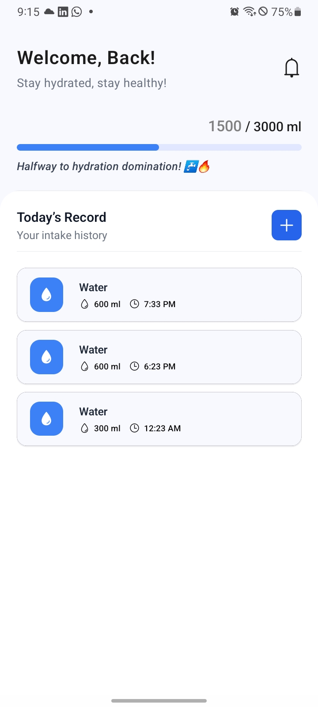
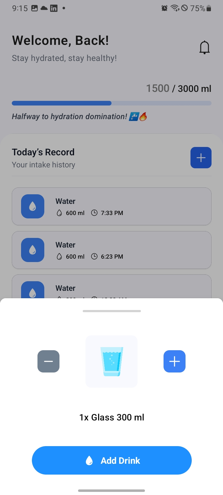
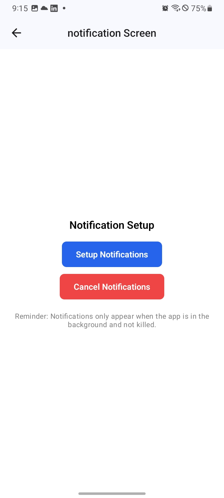

# 💧 Hydro Buddy

**Hydro Buddy** is your personal water intake tracker built with **React Native** and **Expo**. Stay hydrated, stay healthy — effortlessly!

---

## 📱 Features

- 🧠 **Smart Recommendation** – Calculates your daily water intake goal based on age and weight.
- 🥤 **Glass Tracking** – One tap to log a 250ml glass of water.
- 📊 **Progress Visualization** – Beautiful progress bar and stats.
- 📆 **Daily History** – View your past intake throughout the day.
- 🔔 **Reminders** – Get timely notifications to drink water.
- 💬 **Motivational Messages** – Encouraging prompts to keep you on track.

---

## 🖼️ Screenshots

| Home Screen | Add Intake | Notification Screen |
|-------------|------------|---------------------|
|  |  |   |

---

## 🚀 Getting Started

### 1. Clone the repository

```bash
git clone https://github.com/your-username/hydro-buddy.git
cd hydro-buddy
````

### 2. Install dependencies

```bash
npm install
```

### 3. Run the app

```bash
npx expo start
```

> Make sure you have Expo CLI installed:
> `npm install -g expo-cli`

---

## ⚙️ Tech Stack

* [React Native](https://reactnative.dev/)
* [Expo](https://expo.dev/)
* [TypeScript](https://www.typescriptlang.org/)
* [React Native Action Sheet](https://github.com/rafgraph/react-native-actions-sheet)
* [Expo Notifications](https://docs.expo.dev/versions/latest/sdk/notifications/)

---

## 📂 Project Structure

```
hydro-buddy/
├── assets/               # Icons and images
├── components/           # UI components like IntakeHistoryTile
├── screens/              # App screens (Home, Add, Settings)
├── utils/                # Helper logic (intakeCalculator, storage, messages)
├── app.json              # Expo configuration
├── package.json
└── README.md
```

---

## 📦 Local Storage (via MMKV/AsyncStorage)

* `age`, `weight` — basic user info
* `total_YYYY-MM-DD` — total ml consumed that day
* `YYYY-MM-DD` — JSON array of intake logs for the day

---

## 🙌 Author

Made with 💙 by [Salman Shaikh](https://github.com/TechSmith90210)

---

## 📜 License

This project is licensed under the [MIT License](LICENSE).